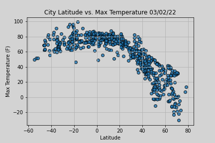

# Vacation Planning App

## Overview:
Utilize openweather.org and gmap APIs to prepare an ideal travel itinerary for a user, based on his or her temperature preferences.

## Vacation Planner:
1. Used random number generators to compile a list of geographical coordinates. With Python's citipy library, determined the nearest city to each coordinate. Then used Openweather.org API to pull weather data for each city & saved as a Pandas DataFrame.
3. Based on user inputted temperature preferences, generated a list of potential cities to visit.
4. Prepared a recommended travel itinerary with four cities meeting the user's temperature requirements.

5. Using Google Directions API, mapped out driving routes to supplement the recommended travel itinerary.

## Appendix:
### STEM research - Global Temperature Patterns
Based on the data presented below, we can see that temperatures tend to decrease as we move away from the equator.

 Using linear regression, we can see a strong negative correlation (r-value = -0.87) between latitude vs max temperatures in the northern hemisphere.

Using the same linear regression model, we see a weaker correlation (r-value = 0.43) between latitude vs max temperatures in the southern hemisphere.

